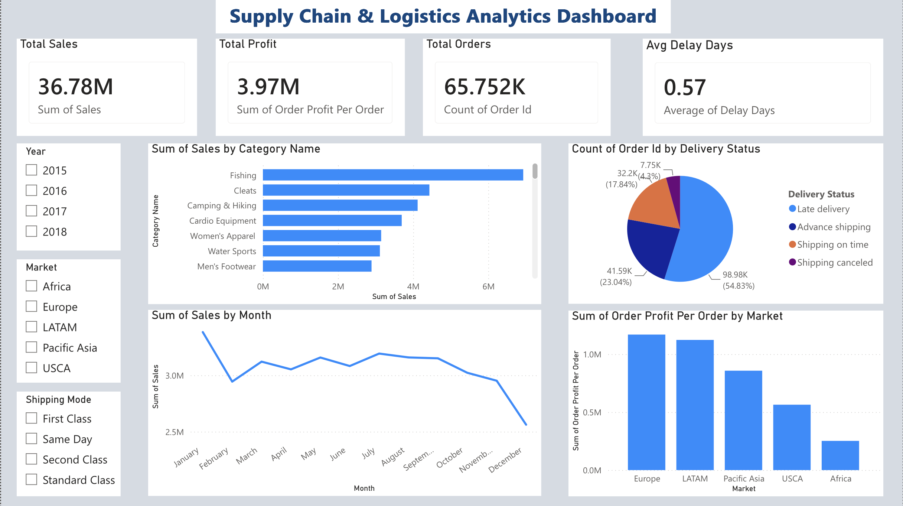
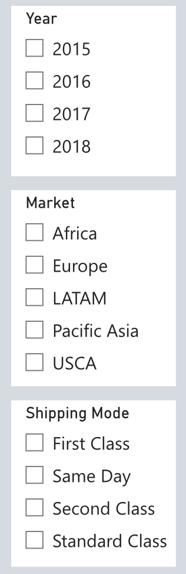
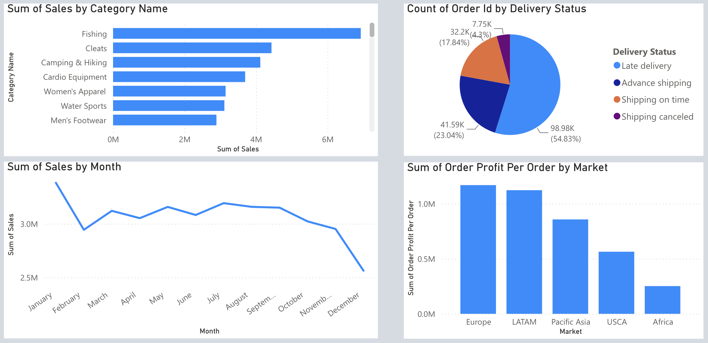

# 🚚 Supply Chain & Logistics Analytics Dashboard

## 📌 Project Overview

This project presents an interactive Power BI dashboard built using a global supply chain dataset. The dashboard provides insights into sales performance, profitability, delivery efficiency, product categories, and regional market trends.

The goal of this project is to help stakeholders monitor key business metrics, identify delivery risks, and make data-driven decisions for supply chain optimization.

---

## 🛠️ Tools & Technologies

- Power BI
- Power Query
- DAX
- Data Visualization
- Data Modeling
- Excel / CSV Dataset

---

## 📊 Dashboard Preview



## KPI Summary




## Visual Analysis



---

## 🎯 Key Performance Indicators (KPIs)

| KPI | Value |
|------|--------|
| Total Sales | 36.78M |
| Total Profit | 3.97M |
| Total Orders | 65.75K |
| Average Delay Days | 0.57 |

---

## 📈 Dashboard Features

### Sales Analysis
- Total sales performance monitoring
- Category-wise sales comparison
- Monthly sales trend analysis

### Profitability Analysis
- Total profit tracking
- Market-wise profit comparison
- Identification of high-performing regions

### Logistics Performance
- Delivery status distribution
- Average shipment delay analysis
- Shipping mode filtering

### Interactive Filtering
Users can dynamically filter dashboard insights by:
- Year
- Market
- Shipping Mode

---

## 📉 Visualizations Included

### KPI Cards
- Total Sales
- Total Profit
- Total Orders
- Average Delay Days

### Charts
- Sales by Category Name (Bar Chart)
- Sales by Month (Line Chart)
- Profit by Market (Column Chart)
- Orders by Delivery Status (Pie Chart)

### Filters (Slicers)
- Year
- Market
- Shipping Mode

---

## 💡 Business Insights

- Europe and LATAM generate the highest overall profits.
- Fishing and Cleats are among the top-performing product categories.
- Most deliveries are completed successfully with relatively low delays.
- Average shipment delay remains below one day.
- Sales remain relatively stable throughout the year with slight seasonal fluctuations.

---

## 📂 Repository Structure

```text
Supply-Chain-Logistics-Analytics-Dashboard
│
├── Dashboard
│   └── Supply_Chain_Logistics_Analytics.pbix
│
├── Screenshots
│   └── Dashboard_Overview.png
│
└── README.md
```

---

## 📁 Dataset

Dataset Source:

https://www.kaggle.com/datasets/shashwatwork/dataco-smart-supply-chain-for-big-data-analysis

Due to GitHub file size limitations, the dataset is not included in this repository.

---

## 🚀 Skills Demonstrated

- Data Cleaning & Transformation
- Dashboard Design
- KPI Development
- Data Visualization
- Business Intelligence Reporting
- Supply Chain Analytics
- Power BI Development

---

## 👩‍💻 Author

**Unnati Patil**

- LinkedIn: https://www.linkedin.com/in/unnati-patil2277
- GitHub: https://github.com/Unnati22p

---

## ⭐ Project Outcome

Developed an end-to-end Power BI dashboard to analyze supply chain performance, monitor business KPIs, evaluate profitability across markets, and improve logistics visibility through interactive visual analytics.
